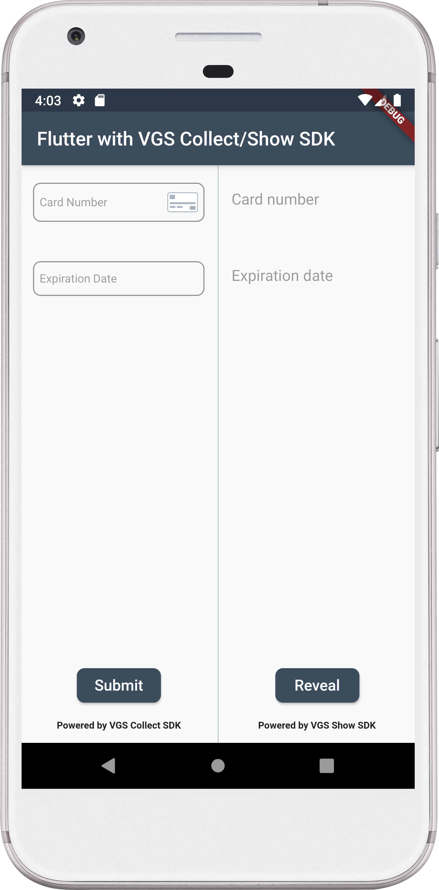

# Flutter integration with VGS Show/Collect SDK demo

This examples shows how easily you can integrate VGS Collect/Show SDKs into your Flutter application and secure sensitive data with us.

> **_NOTE:_**  VGS does not support Flutter. This demo is just an example of how 
>VGS Collect/Show SDKs can be integrated into your Flutter application.

        
        
         

## How to run it?

### Requirements

- Installed <a href="https://flutter.dev/docs/get-started/install" target="_blank">Flutter</a>
- Setup <a href="https://flutter.dev/docs/get-started/editor?tab=androidstudio" target="_blank">IDEA</a>
- Organization with <a href="https://www.verygoodsecurity.com/">VGS</a>

> **_NOTE:_**  Please visit Flutter <a href="https://flutter.dev/docs" target="_blank">documentation</a> 
>for more detailed explanation how to setup Flutter and IDEA.

#### Step 1

Go to your <a href="https://dashboard.verygoodsecurity.com/" target="_blank">VGS organization</a> and establish <a href="https://www.verygoodsecurity.com/docs/getting-started/quick-integration#securing-inbound-connection" target="_blank">Inbound connection</a>. For this demo you can import pre-built route configuration:

-  Find the **configuration.yaml** file inside the app repository and download it.
-  Go to the **Routes** section on the <a href="https://dashboard.verygoodsecurity.com/" target="_blank">Dashboard</a> page and select the **Inbound** tab. 
-  Press **Manage** button at the right corner and select **Import YAML file**.
-  Choose **configuration.yaml** file that you just downloaded and tap on **Save** button to save the route.

#### Step 2

Clone demo application repository.

`git clone git@github.com:verygoodsecurity/vgs-collect-show-flutter-demo.git`

#### Step 3

Setup `"<VAULT_ID>"`.

Find `MainActivity.kt` in `android` package and replace `VAULT_ID` constant with your <a href="https://www.verygoodsecurity.com/docs/terminology/nomenclature#vault" target="_blank">vault id</a>.

Find `DemoAppConfig.swift` in `iOS` package and replace `vaultId` constant with your <a href="https://www.verygoodsecurity.com/docs/terminology/nomenclature#vault" target="_blank">vault id</a>.

#### Step 4 

Run the Android application (<a href="https://flutter.dev/docs/get-started/test-drive?tab=androidstudio" target="_blank">Run app Flutter docs</a>). 

Run the iOS application on Simulator (<a href="https://flutter.dev/docs/get-started/install/macos#set-up-the-ios-simulator" target="_blank">Run app Flutter docs</a>). 

Submit and reveal the form then go to the Logs tab on a Dashboard find a request and secure a payload.
Instruction for this step you can find <a href="https://www.verygoodsecurity.com/docs/getting-started/quick-integration#securing-inbound-connection" target="_blank">here</a>.
